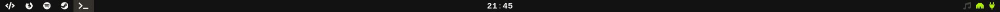

# Bardata
A data generator for lemonbar.


## Features
* Light
* Minimalistic design
* i3 integration
* No unnecessary numbers
* Shows what music you are listening to
* Configurable

## Installation
Before installing, take a look at the __*configuration*__ section.
```
git clone https://github.com/EMattfolk/bardata
cd bardata
cargo build --release
cp target/release/bardata ~/.local/bin/
cp togglebar ~/.local/bin/
```

## Configuration
To configure your bar, open `main.rs` with your favorite text editor and make
the desired changes.

If you want to change the background, fonts or the text color. It is necessary
to edit the start script as well.

When you are done, go ahead and install.

## Dependencies
* rust
* lemonbar-xft
* i3wm
* FontAwesome (optional, but recommended)

## Uninstallation
If you wish to remove bardata from your system, run these commands
```
rm ~/.local/bin/bardata
rm ~/.local/bin/togglebar
```
And finally, remove the git repo.
